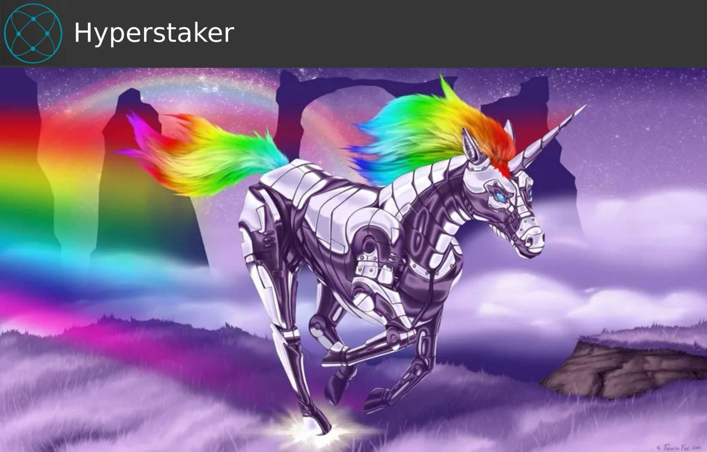

<div align="center">
<h1>

</h1>
</div>

# 🦄 Hyperstaker

[Overview](#overview) •
[Features](#features) •
[Contribute](#contribute) •

## Overview <a name="overview"></a>

Hyperstaker is a decentralized platform which super charges early stage software projects by attaching early contributors to future any project success. It does this by bridging the funding gap between innovation and venture capital by creating utility, value, and demand for Hypercerts. The platform allows users to predict and fund promising public goods projects while securing a vested interest in their success.

## Features <a name="features"></a>

- Project discovery and funding interface
- Enables donations to projects
- Integration with Hypercerts for impact tracking
- Staking on Hypercerts (coming soon)
- Retro-funding support

## Contribute <a name="contribute"></a>

Contact us on Twitter or Discord to talk


<br>

This is a [Next.js](https://nextjs.org/) project bootstrapped with [`create-next-app`](https://github.com/vercel/next.js/tree/canary/packages/create-next-app).

<br>

###Partners
- Hypercerts
- Allo Protocol
- Funding the Commons

### Contributing
Contributions are welcome! Please feel free to submit a Pull Request.

### License
This project is licensed under the MIT License - see the LICENSE file for details.

### Support
For support, please open an issue in the GitHub repository or contact the team at [contact information].


## Getting Started

Set up environment variables:
Create a `.env.local` file in the root directory and add:

Set up environment variables:

```
NEXT_PUBLIC_WALLETCONNECT_ID=your_wallet_connect_project_id
```

First, run the development server:

```bash
npm run dev
# or
yarn dev
# or
pnpm dev
# or
bun dev
```

Open [http://localhost:3000](http://localhost:3000) with your browser to see the result.

You can start editing the page by modifying `app/page.tsx`. The page auto-updates as you edit the file.

This project uses [`next/font`](https://nextjs.org/docs/basic-features/font-optimization) to automatically optimize and load Inter, a custom Google Font.

## Learn More

To learn more about Next.js, take a look at the following resources:

- [Next.js Documentation](https://nextjs.org/docs) - learn about Next.js features and API.
- [Learn Next.js](https://nextjs.org/learn) - an interactive Next.js tutorial.

You can check out [the Next.js GitHub repository](https://github.com/vercel/next.js/) - your feedback and contributions are welcome!

## Deploy on Vercel

The easiest way to deploy your Next.js app is to use the [Vercel Platform](https://vercel.com/new?utm_medium=default-template&filter=next.js&utm_source=create-next-app&utm_campaign=create-next-app-readme) from the creators of Next.js.

Check out our [Next.js deployment documentation](https://nextjs.org/docs/deployment) for more details.
# hyperstaker
